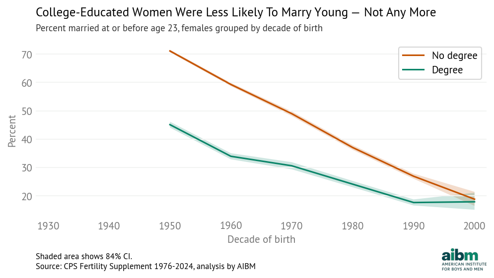
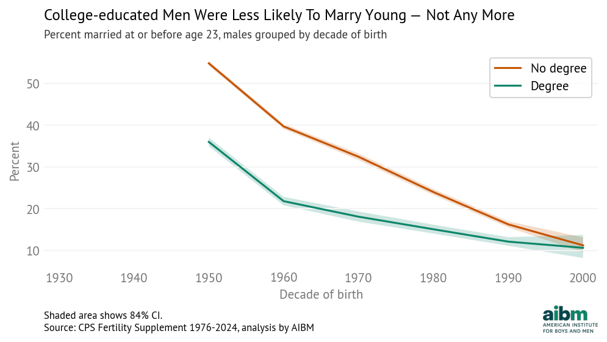
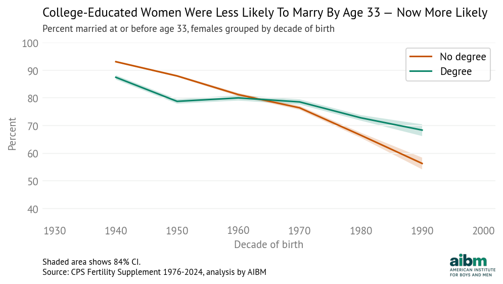
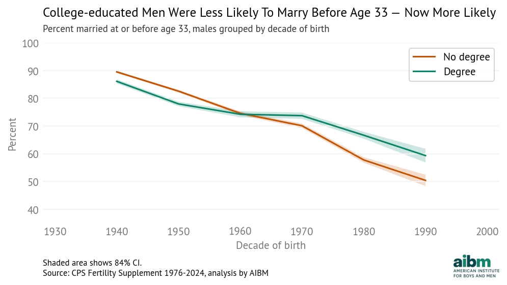
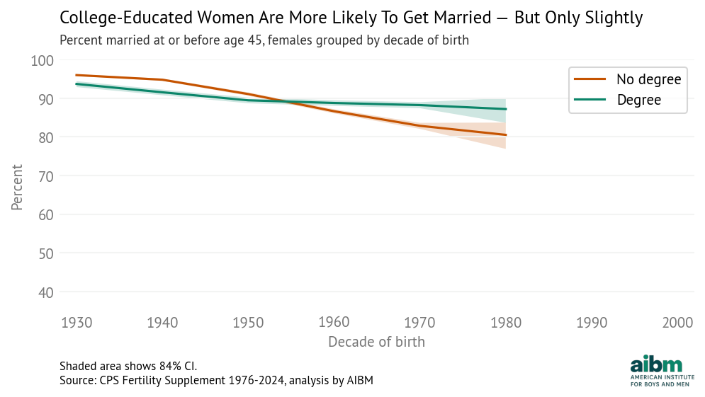
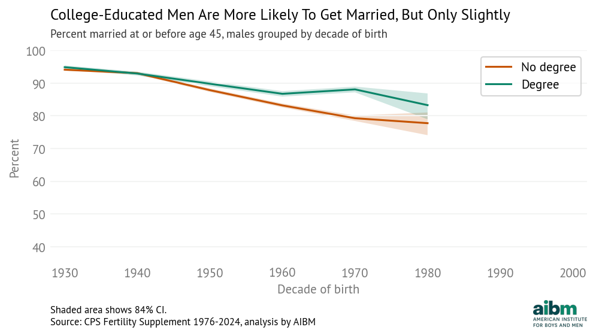

# Marriage and Education: CPS Figures

This page presents a series of figures illustrating the relationship between marriage and education using data from the Current Population Survey (CPS). Each figure highlights a different aspect of the trends or differences by educational attainment.

---

## Figure 1: marriage_education_cps01.png

**Figure 1.** _[Insert description of the data shown in this figure, e.g., overall marriage rates by education level.]_

---

## Figure 2: marriage_education_cps02.png

**Figure 2.** _[Insert description of trends over time or comparison across demographic groups.]_

---

## Figure 3: marriage_education_cps03.png

**Figure 3.** _[Insert explanation of how marriage rates vary by age and education.]_

---

## Figure 4: marriage_education_cps04.png

**Figure 4.** _[Insert caption interpreting cross-sectional differences or historical changes.]_

---

## Figure 5: marriage_education_cps05.png

**Figure 5.** _[Add a brief note about what this figure adds to the analysis or confirms about earlier trends.]_

---

## Figure 6: marriage_education_cps06.png

**Figure 6.** _[Provide any final observations or synthesize findings from the full set of figures.]_

---

_This page is part of an ongoing analysis of marriage and education using CPS data. All figures are generated from publicly available datasets and can be reproduced using the associated code repository._
